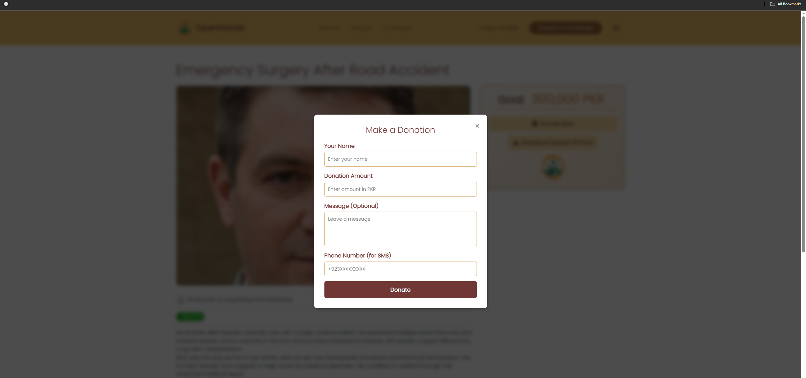
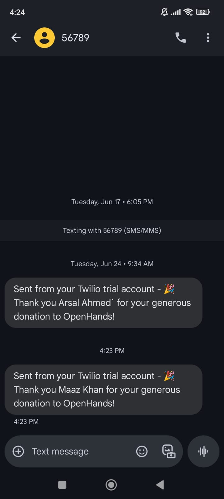
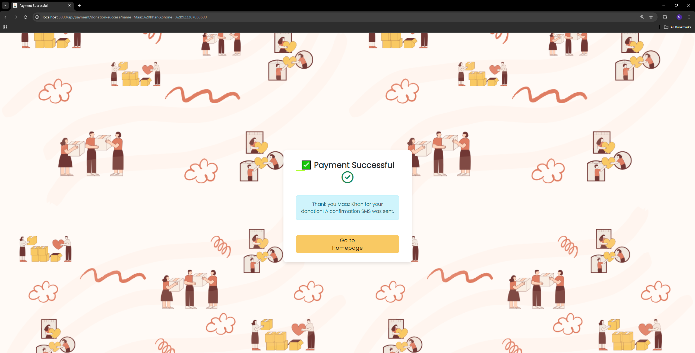
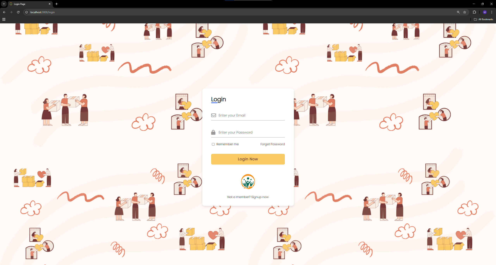
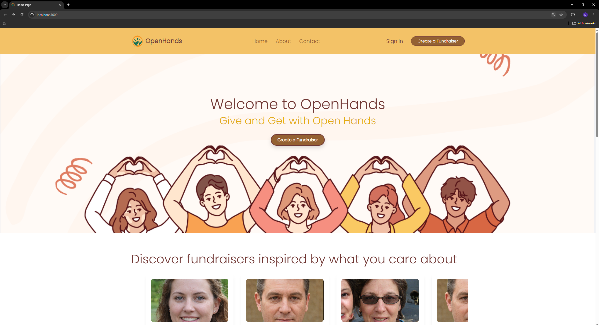
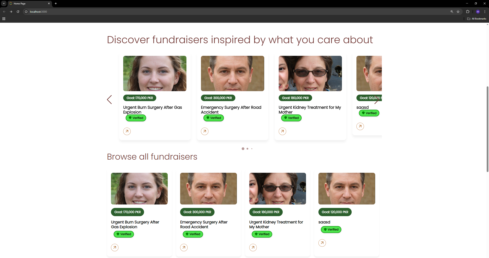
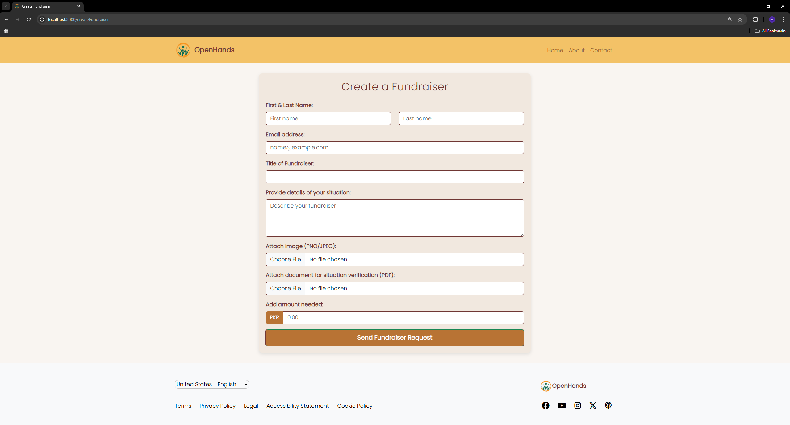
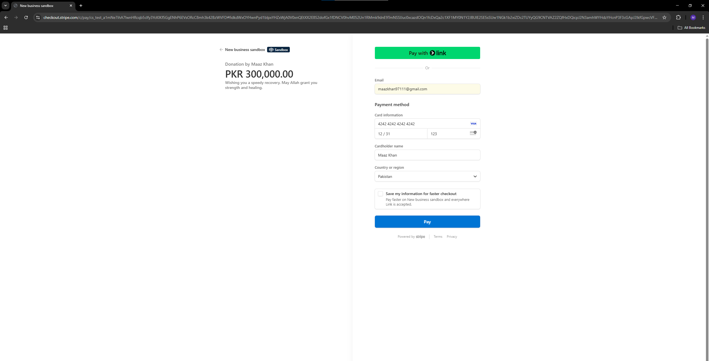
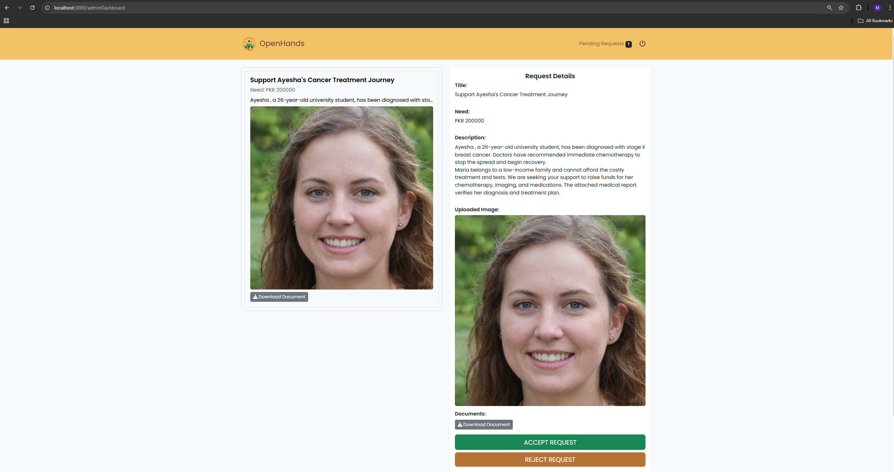

# 👐 OpenHands – Fundraiser Platform

OpenHands is a modern, full-stack **fundraising platform** inspired by GoFundMe, built using **Node.js**, **Express**, **Prisma (MySQL)**, **Stripe**, and **Twilio**.  
Users can create fundraisers, donate securely, and receive real-time updates.

---

## 🚀 Features

- 🔐 JWT-based User Authentication
- 💰 Secure Payments via **Stripe**
- 📲 SMS Notifications via **Twilio**
- 📬 Email Notifications via **Nodemailer**
- 📝 Fundraiser Submission & Admin Approval
- 📊 Admin Dashboard with Campaign Management
- 🖼️ Dynamic Campaign Pages
- ✅ Backend Validation
- 🌐 Mobile-Friendly UI (Bootstrap)

---

## 🛠️ Technologies Used

| Tech              | Purpose                   |
| ----------------- | ------------------------- |
| Node.js / Express | Backend Server (API)      |
| Prisma ORM        | Database & Migrations     |
| MySQL             | Relational DB             |
| Stripe            | Donation Payments         |
| Twilio            | SMS Notifications         |
| Nodemailer        | Email Services            |
| Bootstrap         | UI/UX Styling             |
| EJS               | Template Rendering Engine |
| Dotenv            | Environment Configuration |

---

## 📦 Installation & Setup

### 1. Clone the Repository

```bash
git clone https://github.com/Maazk111/OpenHands.git
cd OpenHands

2. Install Dependencies

cd OpenHands
npm install
```

**3. Set Up Environment Variables**
Create a .env file in the root of the project and add these variables:

```bash
SERVER_URL=http://localhost:3000
DATABASE_URL=your-mysql-url
JWT_SECRET=your-secret-key
PORT=3000

# Stripe
STRIPE_PRIVATE_KEY=your-stripe-secret

# Nodemailer
MAIL_USER=your-email@gmail.com
APP_PASSWORD=your-email-app-password

# Twilio
TWILIO_ACCOUNT_SID=your-twilio-sid
TWILIO_AUTH_TOKEN=your-twilio-auth-token
TWILIO_PHONE=+1234567890

```

**4. Run Prisma Migration**

Run the Prisma migration to set up the database schemas:

```bash
npx prisma migrate dev
```

**5. Manually Create An Admin Account In The Database**

To approve/reject fundraiser requests, you need to create an admin account. Run the following query to create a sample account:

```bash
INSERT INTO admin (
  id,
  firstName,
  lastName,
  country,
  city,
  email,
  password,
  username
)
VALUES (
  '84765c2b-5d91-4901-9869-3a66e345b26f',
  'John',
  'Doe',
  'Pakistan',
  'Karachi',
  'maazkhan9711@gmail.com',
  '$2b$10$p9rfuCY/jXgl321mZvRj0ONxdN8Muq.L0wKMDiQUXohJ3bGRhezC2',
  'JohnDoe'
);
```

_The password for this account will be '1234'._

**6. Run The App**

Enter the following command in your terminal to run the app:

```bash
npm run dev
```

Now you can open your browser and go to http://localhost:PORT to see the app in action 😃.

# 📲 Twilio SMS Integration (After Donation)

After a successful Stripe payment, a confirmation SMS is automatically sent to the donor’s mobile number.

This feature is implemented in the `/donate/success` route or via webhook logic.

The SMS is sent using **Twilio’s Node.js SDK**.

⚠️ **Note:** This feature works for verified numbers only while in Twilio trial mode.

---

## ✅ Donation Flow Overview

1. Donor completes a Stripe payment.
2. Backend receives payment success via redirect or webhook.
3. A confirmation SMS is triggered using Twilio.

---

## 📤 SMS Confirmation Screenshots

- **Donation Page**

  

- **Message Sent (Backend Status)**

  

- **SMS Confirmation (Received on Phone)**

  

---

## 📷 UI Screenshots

- **Login Page**

  

- **Landing Page**

    
  

- **Create Fundraiser Page**

  

- **Fundraiser Page**

  

- **Stripe Payment Page**

  

- **Admin Dashboard**

  

---

## 👥 Contributors

- Muhammad Maaz Khan
- Shayan Adnan Hasan
- Mahnoor Arshad
- Farrukh Iqbal
- Syed Minhal Ali
